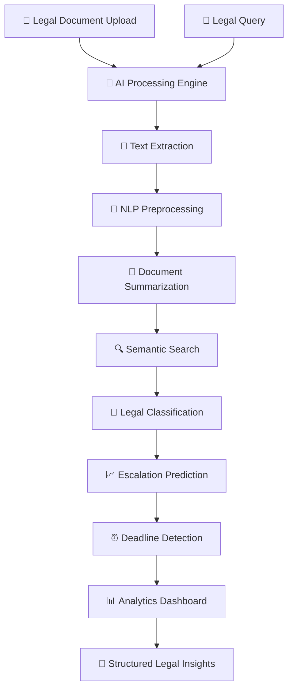

<!-- ============================================ -->
<!--                LegiSight Banner              -->
<!-- ============================================ -->

<div align="center">

# ⚖️ LegiSight

# Cognitive Legal Insight Engine

## Decode Law. Derive Intelligence. Decide with Confidence. 🧠

</div>

---

<p align="center">


</p>

---

# 📖 Project Description

**LegiSight** is an AI-powered Cognitive Legal Insight Engine designed to transform complex legal documents into structured, actionable intelligence using Natural Language Processing (NLP), Machine Learning, Semantic Search, and Generative AI.

Instead of manually reviewing lengthy legal documents, users can upload legal case files or ask legal questions to receive intelligent summaries, semantic insights, legal classifications, deadline predictions, escalation analysis, and interactive visualizations.

LegiSight combines document understanding, contextual reasoning, legal analytics, and explainable AI into a unified platform, making legal research significantly faster, smarter, and more accessible.

Whether used by law students, legal professionals, researchers, startups, or legal-tech organizations, LegiSight simplifies legal intelligence through modern AI.

---

# ✨ Key Highlights

- ⚖️ AI-Powered Legal Intelligence Engine
- 📄 Automatic Legal Document Summarization
- 💬 Intelligent Legal Question Answering
- 🔍 Semantic Case Similarity Search
- 🧠 Machine Learning-Based Legal Classification
- 📈 Case Escalation Prediction
- ⏰ Legal Deadline Tracking
- 🔑 Named Entity & Keyword Extraction
- 📊 Interactive Analytics Dashboard
- 📂 PDF & Text Document Processing
- 🤖 Explainable AI Recommendations
- ⚡ CPU-Optimized Processing

---

# 🏗 System Architecture

LegiSight follows a modular AI pipeline that converts raw legal documents into structured legal intelligence through document processing, NLP, semantic retrieval, machine learning, and explainable analytics.



---

### 🔄 Application Workflow

1. Upload a legal document or enter a legal query.
2. Extract text from PDF or TXT documents.
3. Clean and preprocess legal content.
4. Generate AI-powered document summaries.
5. Perform semantic similarity search.
6. Classify legal cases using Machine Learning.
7. Predict escalation probability.
8. Detect important legal deadlines.
9. Extract legal entities and keywords.
10. Visualize insights using interactive dashboards.
11. Generate structured legal intelligence for users.

---

# 📊 Feature Comparison

| Feature | Traditional Legal Search | LegiSight |
|:---|:---:|:---:|
| Document Understanding | ❌ | ✅ AI Powered |
| Legal Summarization | ❌ | ✅ NLP Based |
| Semantic Search | Keyword Based | ✅ Meaning Based |
| Legal Classification | Manual | ✅ Machine Learning |
| Deadline Tracking | ❌ | ✅ Automated |
| Escalation Prediction | ❌ | ✅ AI Powered |
| Entity Recognition | ❌ | ✅ NLP |
| Explainable Results | ❌ | ✅ Detailed Insights |
| Interactive Dashboard | ❌ | ✅ Plotly Analytics |
| Processing | Manual | ✅ CPU Optimized |

---

# ✨ Core Features

## 📄 Intelligent Legal Document Summarization

- Automatic document summarization
- Context-aware legal understanding
- Important clause extraction
- Concise legal insights
- Long document compression

---

## 🔍 Semantic Legal Search

- Embedding-based similarity search
- Context-aware legal retrieval
- Relevant case recommendations
- Intelligent legal matching
- Fast semantic lookup

---

## 🧠 Machine Learning Legal Classification

- Automatic legal category prediction
- Multi-class case classification
- Confidence score generation
- Trained Scikit-Learn models
- Explainable predictions

---

## 📈 Case Escalation Prediction

- Predicts escalation probability
- Identifies high-risk legal cases
- Early warning generation
- ML-based prediction engine

---

## ⏰ Legal Deadline Tracking

- Deadline extraction
- Timeline monitoring
- Important date identification
- Legal schedule management

---

## 🔑 Keyword & Entity Extraction

- Person names
- Organizations
- Legal Acts
- Sections
- Locations
- Important legal keywords

---

## 📊 Interactive Legal Analytics

- Case distribution
- Escalation statistics
- Legal trends
- Dashboard visualization
- Plotly interactive charts

---
# 🛠 Technology Stack

| Layer | Technology |
|:---|:---|
| Programming Language | Python 3.11 |
| User Interface | Streamlit |
| Natural Language Processing | Hugging Face Transformers |
| Text Embeddings | Sentence Transformers |
| Machine Learning | Scikit-Learn |
| Data Processing | Pandas + NumPy |
| Data Visualization | Plotly + Matplotlib |
| Document Processing | PyPDF2 / PDFPlumber |
| Database | PostgreSQL |
| Similarity Search | Cosine Similarity |
| PDF Reports | FPDF |
| Deployment | Streamlit Cloud |
| Version Control | Git & GitHub |

---

# 📂 Project Structure

```text
LEGISIGHT-A-COGNITIVE-LEGAL-INSIGHT-ENGINE/
│
├── app.py
├── requirements.txt
├── README.md
│
├── data/
│   ├── cleaned_legal_cases.csv
│   └── legal_cases_1000.csv
│
├── models/
│   ├── embeddings.pkl
│   ├── escalation_model.pkl
│   └── tfidf_vectorizer.pkl
│
├── legisight_cases/
│   ├── case1_murder.txt
│   ├── case2_assault.txt
│   ├── case3_domestic.txt
│   ├── case4_fraud.txt
│   ├── case5_cybercrime.txt
│   ├── case6_property.txt
│   ├── case7_contract.txt
│   ├── case8_harassment.txt
│   ├── case9_corruption.txt
│   └── case10_theft.txt
│
├── utils/
│   ├── summarizer.py
│   ├── search.py
│   ├── deadline.py
│   ├── prediction.py
│   └── visualization.py
│
├── diagrams/
│   ├── SYSTEM ARCHITECTURE.png
│   ├── ERD.png
│   ├── FLOWCHART.png
│   ├── UML.png
│   ├── USE CASE.png
│   └── SEQUENCE.png
│
├── notebooks/
│   ├── data_preprocessing.ipynb
│   ├── ml_model.ipynb
│   └── embeddings.ipynb
│
└── Screenshots/
    ├── 1.jpg
    ├── 2.jpg
    ├── 3.jpg
    ├── ...
    └── 12.jpg
```

---

# 📸 Application Preview

## 🏠 Dashboard


---


The screenshots above demonstrate LegiSight's complete legal intelligence workflow—from legal document upload and preprocessing to AI-powered summarization, semantic retrieval, legal classification, escalation prediction, deadline tracking, analytics, and structured legal insight generation.


# ⚙ Installation

## Prerequisites

- Python 3.11+
- pip

---

### Clone Repository

```bash
git clone https://github.com/Keya3639/LEGISIGHT-A-COGNITIVE-LEGAL-INSIGHT-ENGINE.git

cd LEGISIGHT-A-COGNITIVE-LEGAL-INSIGHT-ENGINE
```

---

### Install Dependencies

```bash
pip install -r requirements.txt
```

---

### Run Application

```bash
streamlit run app.py
```

---

### Alternative Execution

```bash
python app.py
```

---

# 🚀 Demo Workflow

| Step | Action |
|:--:|:---|
| 1 | Upload Legal Document (PDF/TXT) |
| 2 | Ask a Legal Question |
| 3 | AI Processes Document |
| 4 | View Document Summary |
| 5 | Perform Semantic Search |
| 6 | Predict Legal Category |
| 7 | Detect Escalation Risk |
| 8 | Track Important Deadlines |
| 9 | Explore Interactive Analytics |
| 10 | Export Structured Legal Insights |

---
# 🌟 Why LegiSight?

Unlike conventional legal information systems that rely primarily on keyword matching and manual document review, **LegiSight** leverages Artificial Intelligence, Natural Language Processing, and Machine Learning to understand legal documents semantically and transform them into actionable legal intelligence.

LegiSight enables users to summarize lengthy legal documents, discover similar cases, classify legal matters, predict escalation risks, track important legal deadlines, extract legal entities, and visualize legal insights—all within a single AI-powered platform.

Whether you are a legal professional, law student, researcher, startup, or legal-tech enthusiast, LegiSight simplifies complex legal analysis through intelligent automation.

**LegiSight doesn't just search legal documents—it understands them.**

---

# 🔮 Future Enhancements

| Phase | Features |
|:---|:---|
| Phase 1 | Conversational Legal AI Assistant |
| Phase 2 | Multilingual Legal Intelligence |
| Phase 3 | AI-Based Legal Citation Generator |
| Phase 4 | Court Judgment Prediction |
| Phase 5 | Integration with Government Legal Databases |
| Phase 6 | Voice-Based Legal Query System |
| Phase 7 | Explainable AI for Legal Reasoning |
| Phase 8 | Legal Knowledge Graph |
| Phase 9 | Cloud-Based Enterprise Deployment |

---

# 🚀 Potential Applications

- ⚖️ Legal Research Automation
- 🏛 Court Case Analysis
- 📄 Legal Document Intelligence
- 🧑‍⚖️ Law Firm Decision Support
- 🎓 AI Learning Platform for Law Students
- 🏢 Corporate Compliance Assistance
- 🤖 Legal AI Assistants
- 📊 Judicial Analytics
- 📚 Legal Knowledge Management

---

# 🎯 Advantages

- ⚡ Significantly reduces legal research time
- 📖 Simplifies complex legal language
- 🧠 AI-assisted legal reasoning
- 📊 Interactive analytics dashboards
- 🔍 Semantic case retrieval
- 📈 Predictive legal intelligence
- 📂 Supports PDF & Text documents
- 💬 User-friendly Streamlit interface
- 🖥 CPU-only execution (No GPU required)

---

# 🛣 Roadmap

- ✅ AI-Powered Legal Summarization
- ✅ Semantic Search Engine
- ✅ Legal Case Classification
- ✅ Deadline Tracking
- ✅ Escalation Prediction
- ✅ Interactive Analytics Dashboard
- 🔄 Retrieval-Augmented Generation (RAG)
- 🔄 Legal Chat Assistant
- 🔄 Cloud Deployment
- 🔄 REST API Support

---

# 👩‍💻 Developer

## Keya Das

**MCA (Artificial Intelligence & Data Science)**

🌐 **GitHub**

https://github.com/Keya3639

📧 **Email**

keyakarunamoydas@gmail.com

---

# 🙏 Acknowledgements

This project was developed using the following open-source technologies and frameworks:

- 🧠 Hugging Face Transformers
- 🤗 Sentence Transformers
- 🎨 Streamlit
- 🐍 Python
- 🐼 Pandas
- 📊 NumPy
- 🤖 Scikit-Learn
- 📈 Plotly
- 📑 PyPDF2
- 📚 PDFPlumber
- 🌍 Open Source Community

---

# 📜 License

This project is intended for educational, research, and portfolio purposes.

---

<div align="center">

# ⚖️ LegiSight

### Decode Law. Derive Intelligence. Decide with Confidence. 🧠

<br>

**Built with ❤️ using**

**Python • Streamlit • Hugging Face Transformers • Sentence Transformers • Pandas • NumPy • Scikit-Learn • Plotly**

<br>

⭐ If you found this project useful, consider giving it a **Star** on GitHub!

</div>
